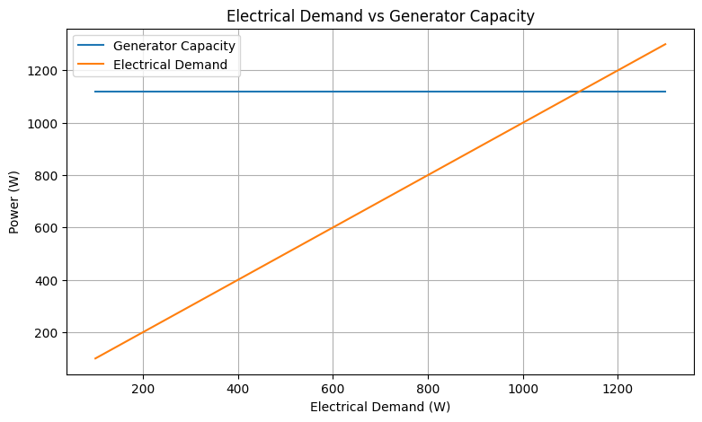
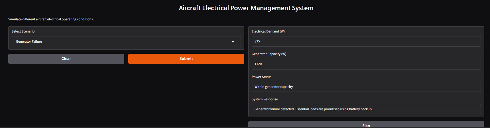

# Aircraft-Electrical-Power-Management
This project is a simplified simulation of an aircraft electrical power system developed using Python

This project was made by combining knowledge and skills that I gained from various learning experiences

I completed a British Airways job simulation, where British Airways introduced me to the engineering and operational considerations in the aviation industry. The British Airways job simulation helped broaden my understanding of aircraft, aviation operations, and the importance of reliable aircraft systems

I also completed a GE Aerospace Electronic Engineering job simulation which strengthened my interest in electronic systems and gave me further exposure to engineering concepts related to aircraft technology and system reliability

Alongside these experiences I completed a Software Engineering course where Software Engineering taught me programming, problem solving and using software to represent and analyse systems.

I wanted to combine these areas than treating them as separate experiences. This led me to develop an aircraft electrical power-management and fault-detection system using Python

Objectives:
Model a simplified aircraft electrical power system.
Calculate the current and power requirements of different aircraft loads
Simulate the distribution of electrical power through different buses
Detect electrical faults, including overloads and generator failure
Simulate the use of a battery as a backup power source
Analyse the reliability of the electrical system under different operating conditions

Fault Detection & Scenarios
The system was tested under three conditions:
Normal Operation:875 W demand, below the 1120 W generator capacity
Generator Failure: Utility loads are disconnected to prioritize essential systems using battery backup
Electrical Overload:Increased demand and an overloaded Navigation circuit used to test fault detection and circuit breaker operation

RESULTS:
Results & Analysis

The system successfully detected normal operation, generator overload, and circuit breaker faults.
Normal demand was **875 W**, while the generator capacity was **1120 W**. Increasing demand to **1125 W** triggered an overload.

Technologies and softwares Used:

* **Python**
* **Google Colab**
* **Gradio**
* **Matplotlib**

Future Improvements:

Add more realistic aircraft electrical loads
Include more detailed fault conditions
Improve the load-shedding system
Add more advanced visualisations and testing

Conclusion:
This project developed a simplified aircraft electrical power management and fault detection system using Python. It demonstrated how electrical loads, power distribution, backup systems, and fault conditions can be modelled and tested.

## Project Screenshots

### Electrical Demand Analysis

### Results

### Interactive Interface

